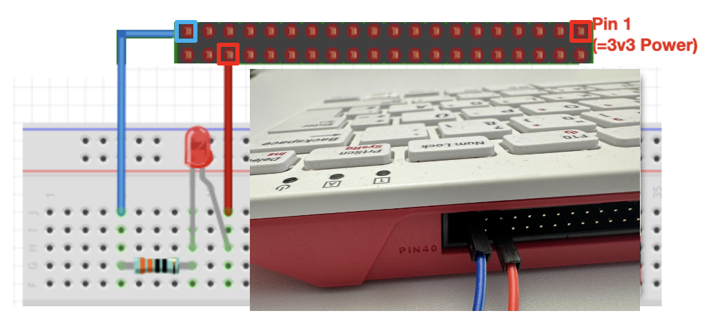

# Assignment 1 — Report

> **How to use this file.** This file *is* your hand-in. Edit it directly (in Codespaces,
> in your browser, or in any editor) and commit your changes.
>
> Every place you need to write something contains a line starting with `TODO:`.
> Replace that whole line with your answer. When no `TODO:` lines are left, the
> **Submission check** in the Actions tab turns green.
>
> Do not rename this file, and do not delete the `##` / `###` headings — we grade against them.

---

## 0. Team & process

You work in your assigned group of two. Both names go here, whoever created the repository.

| Field | Your entry |
| --- | --- |
| Group number | TODO: |
| Team member 1 (last name, first name) | TODO: |
| Team member 2 (last name, first name) | TODO: |

### 0.1 Roles

Who did what? One or two sentences per person.

TODO: replace this line with your answer.

### 0.2 Pitfalls

What were the major pitfalls you ran into, and how did you get past them?

TODO: replace this line with your answer.

### 0.3 Time spent

Roughly how many hours did this assignment take the two of you in total?

TODO: replace this line with your answer.

### 0.4 AI usage

You are **encouraged** to use AI for this assignment — but to *understand*, not to
*outsource*. Briefly state which tools you used and for what.

TODO: replace this line with your answer.

---

## 1. Bandit Game: level 3 → 10 (1pt)

Work through the [OverTheWire Bandit](https://overthewire.org/wargames/bandit/) challenges
from **Level 3 → 4** up to **Level 9 → 10**.

For every level, fill in all three fields. "How you found it" is the part that earns the
points — a password with no explanation is worth very little.

> **One-liner challenge (optional, no extra points but good practice):** where a level needs
> several commands, try to chain them into a single line with pipes (`|`), `&&` or `;`.

<!-- Repeat the same three fields for each level. Keep the headings as they are. -->

### Level 3 → 4

**Command(s) used:**

```console
TODO: your command(s) here
```

**Password found:**

TODO: replace this line with your answer.

**How you found the solution:**

TODO: replace this line with your answer.

### Level 4 → 5

**Command(s) used:**

```console
TODO: your command(s) here
```

**Password found:**

TODO: replace this line with your answer.

**How you found the solution:**

TODO: replace this line with your answer.

### Level 5 → 6

**Command(s) used:**

```console
TODO: your command(s) here
```

**Password found:**

TODO: replace this line with your answer.

**How you found the solution:**

TODO: replace this line with your answer.

### Level 6 → 7

**Command(s) used:**

```console
TODO: your command(s) here
```

**Password found:**

TODO: replace this line with your answer.

**How you found the solution:**

TODO: replace this line with your answer.

### Level 7 → 8

**Command(s) used:**

```console
TODO: your command(s) here
```

**Password found:**

TODO: replace this line with your answer.

**How you found the solution:**

TODO: replace this line with your answer.

### Level 8 → 9

**Command(s) used:**

```console
TODO: your command(s) here
```

**Password found:**

TODO: replace this line with your answer.

**How you found the solution:**

TODO: replace this line with your answer.

### Level 9 → 10

**Command(s) used:**

```console
TODO: your command(s) here
```

**Password found:**

TODO: replace this line with your answer.

**How you found the solution:**

TODO: replace this line with your answer.

---

## 2. Toolchain Setup (1pt)

Install the ARM GNU toolchain **13.3.Rel1** on **your own machine** (see
[`docs/TOOLCHAIN.md`](docs/TOOLCHAIN.md)).

> ⚠️ This task must be done on your own computer, not in the Codespace. The Codespace
> already has the toolchain, so a screenshot taken there does not demonstrate anything —
> and you need a local toolchain anyway to write `kernel7l.img` onto a physical SD card.

### 2.1 Screenshot

Take a screenshot of your console showing the output of `arm-none-eabi-objcopy --version`,
save it as **`screenshots/t1.png`**, and commit it.

Make sure your terminal prompt is visible in the screenshot.

Once committed it will render here:


### 2.2 Version output

Paste the text output of `arm-none-eabi-objcopy --version` here as well:

```console
TODO: paste the output here
```

---

## 3. Bare Metal "Hello World" (4pt)

### 3.1 Prepare the SD card (0.5pt)

Confirm you formatted the SD card as FAT32 and copied `config.txt`, `fixup4.dat` and
`start4.elf` from [`boot/`](boot/) to the **root** of the card (not into a `boot/` folder).

Which operating system and which tool did you use to format the card?

TODO: replace this line with your answer.

### 3.2 Blink the power LED (0.5pt)

Cross-compile `power_blink.c`, copy the resulting `kernel7l.img` to the SD card, and boot
the Pi. Describe what you observed.

TODO: replace this line with your answer.

### 3.3 Examine the code and understand the BCM2711 (3pt)

Read [`power_blink.c`](power_blink.c) together with the
[BCM2711 ARM Peripherals manual](docs/bcm2711-peripherals.pdf) — pages **65–70** and **4–6**
are the relevant ones.

#### Q1 — Register address of `gpio[GPFSEL4]` (1pt)

In line 51 of `power_blink.c`, what is the register address represented by `gpio[GPFSEL4]`
according to the manual? **Give your answer as an offset from the GPIO base address**, and
show how you got there.

TODO: replace this line with your answer.

#### Q2 — The value `(1 << 6)` (1pt)

Calculate the value `(1 << 6)` and give it in **binary notation**. According to the manual,
what does it mean when this value is written to `gpio[GPFSEL4]`?

TODO: replace this line with your answer.

#### Q3 — Making GPIO 10–19 outputs (1pt)

How would you modify this line so that *all* GPIO pins covered by **GPIO Function Select
Register 1** (i.e. GPIO 10–19) become outputs?

> **Hint:** use `0` for the reserved bit values.

Give the modified line of C code:

```c
TODO: your modified line here
```

And explain your reasoning:

TODO: replace this line with your answer.

---

## 4. Building your own Digital Circuit and Blinking an LED (4pt)

Wire an LED (with the 330 Ω resistor in series!) to **GPIO 16 — physical pin 36**, like this:



Then modify **[`led_blink.c`](led_blink.c)** so it blinks *that* LED instead of the power LED.

Your code is the hand-in for this task. Use this section to explain it.

### 4.1 Which registers and bits did you change, and why?

TODO: replace this line with your answer.

### 4.2 Why does GPIO 16 need a different `GPFSEL` register than GPIO 42?

TODO: replace this line with your answer.

### 4.3 Photo of your circuit (optional but appreciated)

Drop a photo at `screenshots/circuit.jpg` and it will show up here:

<!--  -->

---

## 5. BONUS: LED Experiments (2pt)

Extend your program in **[`led_fade.c`](led_fade.c)** so the LED fades in and out slowly
instead of switching on/off. Any functionally correct approach is accepted.

If you did not attempt the bonus, write `not attempted` below and leave `led_fade.c` as is.

### 5.1 Which approach did you choose, and how does it work?

TODO: replace this line with your answer.

---

## Before you submit

- [ ] No `TODO:` lines left in this file
- [ ] `screenshots/t1.png` committed
- [ ] `led_blink.c` modified and it compiles (`make led_blink`)
- [ ] `led_fade.c` done, or section 5.1 says `not attempted`
- [ ] Everything **committed and pushed**
- [ ] Your partner **and** `lukabekavac` **and** `Karimkh31` added as collaborators
- [ ] **One** of you submitted the repository URL on Canvas (not both)
